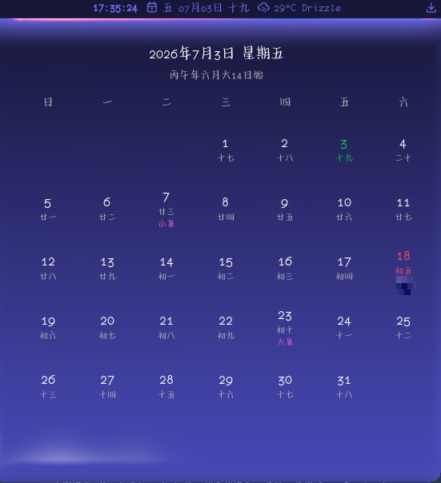
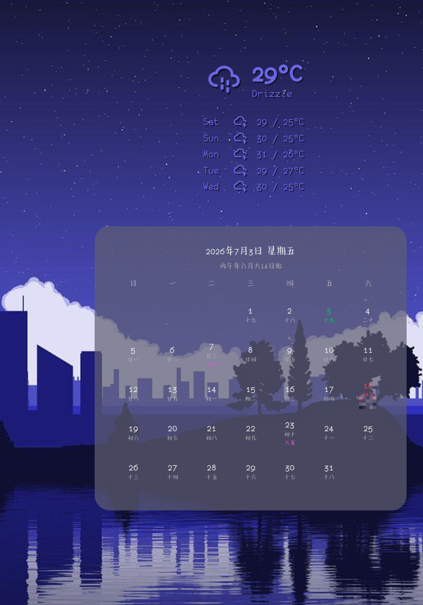
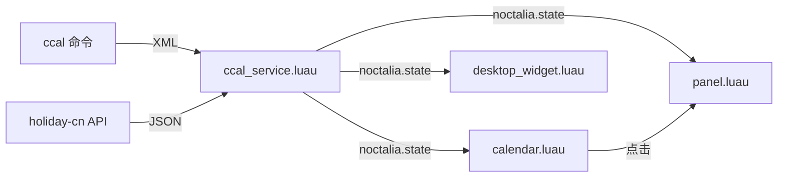

# 中国农历 — Noctalia v5 插件

在 Noctalia v5 状态栏显示中国农历、节气、节假日和调休信息。支持自定义日期事件（生日、纪念日等），点击 bar widget 可弹出完整月历面板，也可添加到桌面作为桌面小组件。

## 效果展示

| 状态栏 Bar Widget | 桌面组件 Desktop Widget |
| --- | --- |
|  |  |

## 功能

- **状态栏显示**：公历 + 农历日期，格式可自定义。
- **月历面板**：点击状态栏弹出完整月历，每日展示公历、农历、节气、节假日标记。
- **桌面组件**：可添加到 Noctalia 桌面，独立显示月历视图。
- **节假日与调休**：自动从 [holiday-cn](https://github.com/NateScarlet/holiday-cn) 拉取中国法定节假日和调休数据，休假日标红且显示"休"字，调休工作日特殊颜色标记。
- **节气显示**：当日为节气时自动显示节气名称（如"夏至""冬至"）。
- **自定义事件**：支持公历（G）和农历（L）两种日期事件，适合生日、纪念日等。
- **静默刷新**：点击 bar widget 静默触发后台刷新，不弹通知、不打开官方设置面板。

## 依赖

- **Noctalia Shell v5.0.0** 或更新版本。
- 系统需安装 `ccal` 命令行工具。

验证 `ccal` 是否可用：

```bash
command -v ccal
ccal -x -g -u "$(date +%m)" "$(date +%Y)"
```

## 安装

将插件目录放到 Noctalia 本地插件路径：

```text
$XDG_DATA_HOME/noctalia/plugins/ccal/
```

未设置 `XDG_DATA_HOME` 时默认为：

```text
~/.local/share/noctalia/plugins/ccal/
```

> 插件 id 为 `noctalia/ccal`，目录名必须使用 `/` 后面的部分 `ccal`。放置后重载 Noctalia 配置或重启 Noctalia，在设置中启用插件并添加「中国农历」bar widget 即可。

也可直接克隆本仓库到上述路径：

```bash
git clone git@github.com:obmutescences/noctalia-ccal.git ~/.local/share/noctalia/plugins/ccal
```

## 配置

### 插件级设置

| 设置项 | 类型 | 默认值 | 说明 |
| --- | --- | --- | --- |
| `refresh_interval` | int | `60` | 后台刷新间隔（秒），范围 15–3600 |
| `fetch_holidays` | bool | `true` | 是否从 holiday-cn 拉取节假日调休数据 |
| `events` | string_list | `[]` | 自定义事件列表，见下方格式说明 |

### Widget 设置（bar）

| 设置项 | 类型 | 默认值 | 说明 |
| --- | --- | --- | --- |
| `date_format` | string | `ddd MM月dd日 LL` | 状态栏日期显示格式 |

### 面板 / 桌面组件设置

| 设置项 | 类型 | 默认值 | 说明 |
| --- | --- | --- | --- |
| `show_solar_term` | bool | `true` | 在日期下方显示当日节气 |
| `highlight_holidays` | bool | `true` | 用不同颜色标记节假日和调休 |

## 日期格式

`date_format` 支持以下占位符：

| Token | 含义 | 示例 |
| --- | --- | --- |
| `d` / `dd` | 公历日 | `3` / `03` |
| `ddd` / `dddd` | 星期 | `三` / `星期三` |
| `M` / `MM` | 公历月 | `2` / `02` |
| `MMM` / `MMMM` | 月份文本 | `2月` / `二月` |
| `yy` / `yyyy` | 年份 | `26` / `2026` |
| `LL` | 农历日或节气 | `初二` / `夏至` |
| `LLL` | 农历月日 | `五月初二` |
| `LLLL` | 干支头 + 农历日 | `丙午年五月小15日始初二` |
| `LY` | 干支年 | `丙午` |
| `LA` | 生肖 | `马` |

常用格式示例：

- `ddd MM月dd日 LL` → `三 07月03日 初九`
- `yyyy/MM/dd LL` → `2026/07/03 初九`
- `yyyy年M月d日 dddd LL` → `2026年7月3日 星期四 初九`

## 自定义事件

在插件设置的 `events` 字段中添加事件，每行一个，格式为：

```text
<类型> <月份>-<日期> <说明>
```

### 公历事件（G）

每年固定公历日期触发，如元旦、国庆、生日：

```text
G 01-01 元旦
G 10-01 国庆节
G 06-15 小明生日
```

### 农历事件（L）

每年固定农历日期触发，如春节、中秋节。注意：此处月份为农历月（正月=1，腊月=12），不含闰月前缀：

```text
L 01-01 春节
L 05-05 端午节
L 08-15 中秋节
```

### 闰月事件

农历日期前加 `L` 前缀表示闰月（极少使用）：

```text
L L04-15 闰四月十五
```

> 事件匹配后会在日期文本后追加说明，如 `07月03日 初九 (小明生日)`。

## IPC

后台 service 无 UI，IPC target 使用 `all`：

```bash
noctalia msg plugin noctalia/ccal:ccal_service all refresh
```

动态修改 bar widget 日期格式：

```bash
noctalia msg plugin noctalia/ccal:calendar focused set_format "yyyy/MM/dd LL"
```

## 架构

| Entry | 文件 | 说明 |
| --- | --- | --- |
| Service | `ccal_service.luau` | 后台单例：检查 ccal、执行命令、解析 XML、拉取 holiday-cn 数据、发布状态 |
| Bar Widget | `calendar.luau` | 状态栏显示：读取状态、格式化日期、点击弹出面板并触发刷新 |
| Panel | `panel.luau` | 月历弹窗面板：完整月份网格，支持节气、节假日高亮、自定义事件 |
| Desktop Widget | `desktop_widget.luau` | 桌面组件：独立月历视图，可常驻桌面 |

所有 entry 通过 `noctalia.state` 共享数据，不直接通信。数据流向：




## 致谢

本插件的农历逻辑参考了 [dms-plugin-ccal](https://github.com/xxyangyoulin/dms-plugin-ccal)，感谢原作者的贡献。
## 许可

MIT
